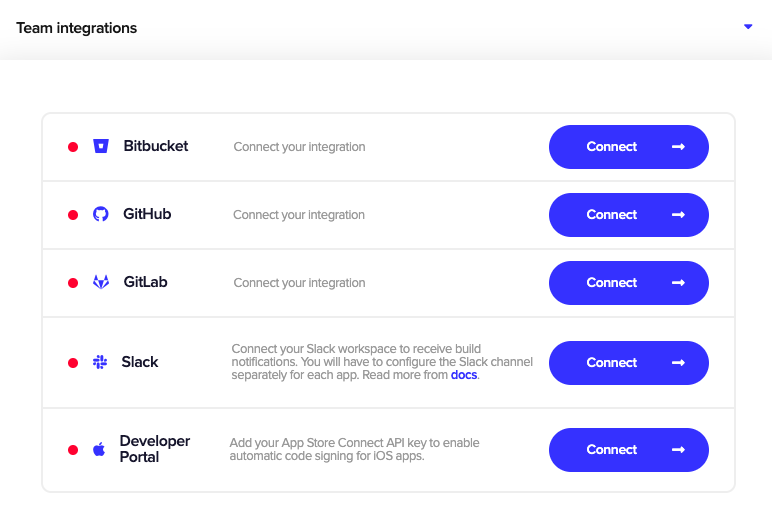
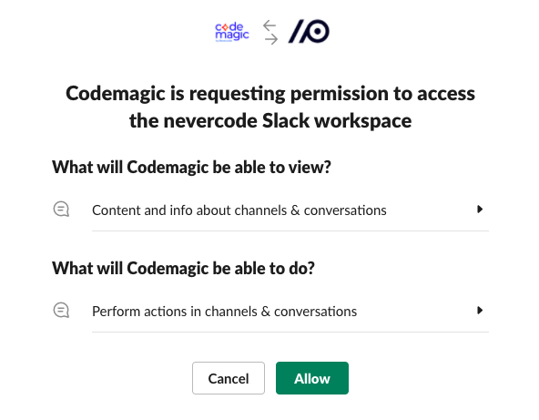
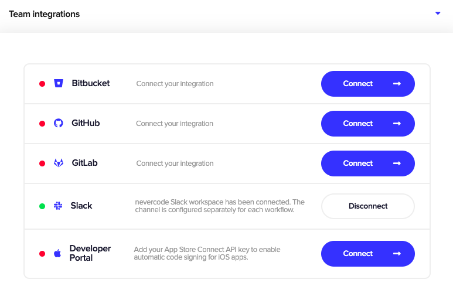

All generated artifacts can be published to external services. The available integrations currently are email, Slack, Google Play and App Store Connect. It is also possible to publish elsewhere with custom scripts, see the examples below.

## Integrations for publishing and notifications

Codemagic has out-of-the-box support for publishing to the services listed below. Read more about each individual integration and see the configuration examples below.

### Email

If the build finishes successfully, release notes (if passed) and the generated artifacts will be published to the provided email address(es). If the build fails, an email with a link to build logs will be sent.

If you don't want to receive an email notification on build success or failure, you can set `success` to `false` or `failure` to `false` accordingly.

```yaml
publishing:
  email:
    recipients:
      - name@example.com
    notify:
      success: false     # To not receive a notification when a build succeeds
      failure: false     # To not receive a notification when a build fails
```

### Slack

Integrate Slack publishing into your Codemagic build pipeline to get notified when a build starts and receive build artifacts or logs when the build finishes.

#### Connecting your Slack workspace

To set up publishing to Slack, you first need to connect your Slack workspace in **User settings > Integrations > Slack** for personal apps and in **Teams > Your_team > Team integrations > Slack** for team apps. 



Click **Connect** next to the Slack integration. You will be then redirected to an authorization page. Review the requested permissions and click **Allow** to give Codemagic Slack app access to your Slack workspace and allow it post build status updates and build artifacts (see also our [privacy policy](https://codemagic.io/privacy-policy/)).



After you have successfully authorized Codemagic and connected your workspace, you will be redirected back to Codemagic. You can disconnect your Slack workspace anytime by clicking **Disconnect**.



#### Configuring Slack publishing

The Slack channel for publishing is configured separately for each workflow in the `publishing` section of `codemagic.yaml` (refer [here](../publishing/email-and-slack-notifications/#slack) if you're configuring app settings in the Flutter workflow editor).


In order to publish to **private channels**, you need to invite Codemagic app to the channels, otherwise the app does not have access to private channels. To invite Codemagic app to private channels, write `@codemagic` in the channel.


If the build finishes successfully, release notes (if passed) and the generated artifacts will be published to the specified channel. If the build fails, a link to the build logs is published. When you set `notify_on_build_start` to `true`, the channel will be notified when a build starts.

If you don't want to receive a Slack notification on build success or failure, you can set `success` to `false` or `failure` to `false` accordingly.

```yaml
publishing:
  slack:
    channel: '#channel-name'
    notify_on_build_start: true    # To receive a notification when a build starts
    notify:
      success: false               # To not receive a notification when a build succeeds
      failure: false               # To not receive a notification when a build fails
```

### Google Play

Codemagic enables you to automatically publish your app to the `internal`, `alpha`, `beta` and `production` tracks on Google Play. In order to do so, you will need to set up a service account in Google Play Console and add the `JSON` key file to your Codemagic configuration file, see how to [set up a service account](../knowledge-base/google-play-api/). The proper way to add your keys to `codemagic.yaml` is to [encrypt](../building/encrypting) the contents of the key file and add the encrypted value into the configuration file.

If your application supports [in-app updates](https://developer.android.com/guide/playcore/in-app-updates) Codemagic allows setting the update priority. Otherwise, `in_app_update_priority` can be omitted or set to `0`.

In addition, Codemagic supports [staged releases](https://support.google.com/googleplay/android-developer/answer/6346149?hl=en), allowing users to choose which fraction of the testers or users get access to the application. To release to everyone, omit `rollout_fraction` from codemagic.yaml. 

```yaml
publishing:
  google_play:                        # For Android app
    credentials: Encrypted(...)       # JSON key file for Google Play service account
    track: alpha                      # Name of the track: internal, alpha, beta, production, internal app sharing
    in_app_update_priority: 3         # Priority of the release (only set if in-app updates are supported): integer in range [0, 5]
    rollout_fraction: 0.25            # Rollout fraction (set only if releasing to a fraction of users): value between (0, 1)
```


You can override the publishing track specified in the configuration file using the environment variable `GOOGLE_PLAY_TRACK`. This is useful if you're starting your builds via [Codemagic API](../rest-api/overview/) and want to build different configurations without editing the configuration file.


### App Store Connect

Codemagic enables you to automatically publish your iOS app to App Store Connect for beta testing with TestFlight or distributing the app to users via App Store.

```yaml
publishing:
  app_store_connect:                  # For iOS app
    apple_id: name@example.com        # Email address used for login
    password: Encrypted(...)          # App-specific password
```

### GitHub releases

Publishing GitHub releases is available for GitHub repositories only.

Publishing happens only for successful builds triggered on tag creation and is unavailable for manual builds.

Note that using `*` wildcard in the beginning of the pattern requires quotation marks around the pattern, otherwise it will violate the `yaml` syntax.

```yaml
publishing:
  github_releases:
    prerelease: false
    artifact_patterns:
      - app-release.apk
      - '*.aab'
```


Note that Codemagic needs **write** permission to be able to publish a GitHub release. If you have signed up via Codemagic GitHub app or have enabled the GitHub app integration, publishing to GitHub is not possible as Codemagic only has **read** access to the repository. If you wish to publish GitHub releases, we recommend you authenticate via OAuth and remove the GitHub app integration in user or team settings as otherwise the GitHub app limitations will prevail. Read more about the signup options [here](../getting-started/signup).


## Publishing a Flutter package to pub.dev

In order to get publishing permissions, first you will need to log in to pub.dev locally. It can be done with running `pub publish --dry-run`.
After that `credentials.json` will be generated which you can use to log in without the need of Google confirmation through browser.

`credentials.json` can be found in the pub cache directory (`~/.pub-cache/credentials.json` on MacOS and Linux, `%APPDATA%\Pub\Cache\credentials.json` on Windows)

```yaml
- echo $CREDENTIALS | base64 --decode > "$FLUTTER_ROOT/.pub-cache/credentials.json"
- flutter pub publish --dry-run
- flutter pub publish -f
```

## Publishing an app to Firebase App Distribution

If you use a Firebase service, encrypt `google-services.json` as `ANDROID_FIREBASE_SECRET` environment variable for Android
or `GoogleService-Info.plist` as `IOS_FIREBASE_SECRET` for iOS.

```bash
echo $ANDROID_FIREBASE_SECRET | base64 --decode > $FCI_BUILD_DIR/android/app/google-services.json
echo $IOS_FIREBASE_SECRET | base64 --decode > $FCI_BUILD_DIR/ios/Runner/GoogleService-Info.plist
```

### Publishing an app using Firebase CLI

Make sure to encrypt `FIREBASE_TOKEN` as an environment variable. Check [documentation](https://firebase.google.com/docs/cli#cli-ci-systems) for details.

Android

```yaml
- name: Publish the app to Firebase App Distribution
  script: |
    apkPath=$(find build -name "*.apk" | head -1)
    if [[ -z ${apkPath} ]]
    then
      echo "No apks were found, skip publishing to Firebase App Distribution"
    else
      echo "Publishing $apkPath to Firebase App Distribution"
      firebase appdistribution:distribute --app <your_android_application_firebase_id> --groups <your_android_testers_group> $apkPath
    fi
```

iOS

```yaml
- name: Publish the app to Firebase App Distribution
  script: |
    ipaPath=$(find build -name "*.ipa" | head -1)
    if [[ -z ${ipaPath} ]]
    then
      echo "No ipas were found, skip publishing to Firebase App Distribution"
    else
      echo "Publishing $ipaPath to Firebase App Distribution"
      firebase appdistribution:distribute --app <your_ios_application_firebase_id> --groups <your_ios_testers_group> $ipaPath
    fi
```

### Publishing an app with Fastlane

Make sure to encrypt `FIREBASE_TOKEN` as an environment variable. Check [documentation](https://firebase.google.com/docs/cli#cli-ci-systems) for details.

Before running a lane, you should install Fastlane Firebase app distribution plugin

```yaml
- name: Install fastlane-plugin-firebase_app_distribution
  script: |
    gem install bundler
    sudo gem install fastlane-plugin-firebase_app_distribution --user-install
```

Then you need to call a lane. This code is similar for Android and iOS.

Android

```yaml
- name: Execute fastlane android publishing task
  script: |
    cd android
    bundle install
    bundle exec fastlane <your_android_lane>
```

iOS

```yaml
- name: Execute fastlane ios publishing task
  script: |
    cd ios
    bundle install
    bundle exec fastlane <your_ios_lane>
```

### Publishing an Android app with Gradle

To authorize an application for Firebase App Distribution, use [Google service account](https://firebase.google.com/docs/app-distribution/android/distribute-gradle#authenticate_using_a_service_account).
Encrypt and add to environment variables these credentials (the file is named something like `yourappname-6e632def9ad4.json`) as `GOOGLE_APP_CREDENTIALS`. Specify the filepath in your `build.gradle` in `firebaseAppDistribution` as `serviceCredentialsFile="your/file/path.json"`.

```gradle
buildTypes {
    ...
    release {
        ...
        firebaseAppDistribution {
            ...
            serviceCredentialsFile="<your/file/path.json>"
        }
    }
```

Note that in case the credentials file is not specified in `firebaseAppDistribution` build type, it will search the filepath in `GOOGLE_APPLICATION_CREDENTIALS` environment variable.

Decode application credentials for Firebase authorization:

```bash
echo $GOOGLE_APP_CREDENTIALS | base64 --decode > $FCI_BUILD_DIR/your/file/path.json
```

Build the application:

```yaml
- echo "flutter.sdk=$HOME/programs/flutter" > "$FCI_BUILD_DIR/android/local.properties"
- flutter packages pub get
- flutter build apk --release
```

Call the `gradlew` task for distribution

```yaml
- name: Distribute app to firebase with gradle plugin
  script: cd android && ./gradlew appDistributionUploadRelease
```



If you didn't specify `serviceCredentialsFile`, you may export it to random location like `/tmp/google-application-credentials.json`

```bash
echo $GOOGLE_APP_CREDENTIALS | base64 --decode > /tmp/google-application-credentials.json
```

And then export the filepath on the gradlew task

```yaml
- name: Distribute app to firebase with gradle plugin
  script: |
    export GOOGLE_APPLICATION_CREDENTIALS=/tmp/google-application-credentials.json
    cd android && ./gradlew appDistributionUploadRelease
```



## Publishing web applications to Firebase Hosting

Publishing web applications to Firebase Hosting With Codemagic publishing to Firebase Hosting is a straight-forward process as the Firebase CLI is already pre-installed on our virtual machines. Please note that before trying to publish to Firebase Hosting, you will have to set it up for your project locally. You can find more information in the official [documentation](https://firebase.google.com/docs/hosting/quickstart) for Firebase.

1. To get started with adding Firebase Hosting to Codemagic, you will need to obtain your Firebase token. In order to do that, run `firebase login:ci` in your local terminal. 
2. After running the command, your default browser should prompt for authorization to your Firebase project - when access is granted, the necessary token will appear in your terminal.
3. Copy and [encrypt](https://github.com/codemagic-ci-cd/codemagic-docs/blob/master/content/building/encrypting) the token using the Codemagic UI.
4. Add your encrypted token to your .yaml file by setting it under your environment variables with the name `FIREBASE_TOKEN`.
5. Create a new script for publishing to Firebase Hosting in your scripts section of the .yaml file and add it right after the build step

```yaml
- name: Publish to Firebase Hosting
  script: |
    firebase deploy --token "$FIREBASE_TOKEN"
```
When the build is successful, you can see your application published to Firebase Hosting. You can find the direct URL to the deployed build also from the log output in Codemagic UI:

```
✔  Deploy complete!

Project Console: https://console.firebase.google.com/project/your-project/overview
Hosting URL: https://your-project.web.app
```
